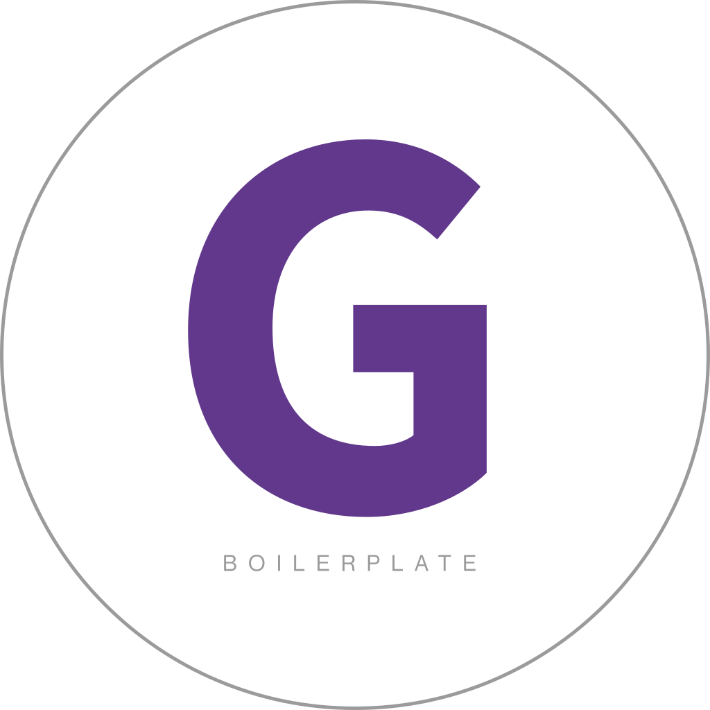

<div>
	
</div>

# 82 Boilerplate Series - Multipage

A chock full of goodness boilerplate with mobile first approach, multipage setup, built on [GatsbyJS](https://www.gatsbyjs.com) with [react-bootstrap](https://github.com/react-bootstrap/react-bootstrap) and [react-hook-form](https://react-hook-form.com).

## Autobots, roll out! 🤖

### Usage

Install dependecies

```
npm i
```

### Components

See [component docs](./src/components/README.md)

### Plugins

#### Fonts

For local hosting and blazing speed use [Typefaces](https://github.com/KyleAMathews/typefaces). Default [Roboto Mono](https://fonts.google.com/specimen/Roboto+Mono?query=roboto) from [Google Fonts](http://fonts.google.com/).

Add or remove fonts in _gatsby-browser.js_

```
import 'typeface-[font-name]';
```

#### Smooth Scroll

[gatsby-plugin-smoothscroll](https://github.com/freddydumont/gatsby-plugin-smoothscroll) from [Smooth Scroll behavior polyfill](https://github.com/iamdustan/smoothscroll#smooth-scroll-behavior-polyfill).

Usefull for in-page anchors.

### Font Awesome

- _Core_ - @fortawesome/fontawesome-svg-core - @fortawesome/react-fontawesome

- _Styles_ - @fortawesome/free-solid-svg-icons - @fortawesome/free-brands-svg-icons - @fortawesome/free-regular-svg-icons

[Search](https://fontawesome.com/icons?d=gallery) Font Awesome icon library

Docs [Font Awesome with React](https://fontawesome.com/how-to-use/on-the-web/using-with/react)

### Deploy

For a free Gatsby-friendly environment, give [Netlify](https://netlify.com) a look.

---

**IGNOR | SAVE FOR LATER | ONE PAGE v MULTI**

Standard usage:

```
<button onClick={() => scrollTo([__TARGET__])}>SOME LINK</button>
```

### One page navigation style

To use it on a links with a top offset:

```
const scrollTo = (e, target) => {
	e.preventDefault();
	const offsetSelector = document.querySelector([__OFFSET__SELECTOR]).clientHeight;
	const topOffset = document.querySelector(target).offsetTop;
	window.scroll({
		top: topOffset - (offsetSelector / 2),
		left: 0,
		behavior: 'smooth'
	});
}

<Link to={target} onClick={(e) => scrollTo(e, target)}>
	{name}
</Link>
```
